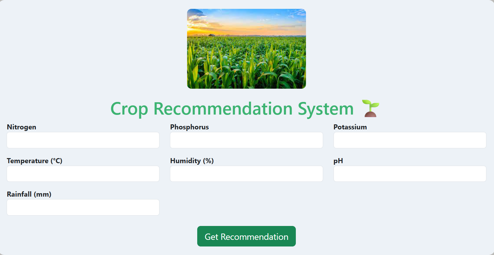

# 🌾 Crop Recommendation System  

A machine learning project that recommends the best crop to grow based on soil and environmental conditions. The system is built using **Random Forest Classifier**, deployed with **Flask** and provides actionable insights for farmers and agricultural decision-making.  

  

---

## ✨ Features  

- 📊 *Data preprocessing* and normalization of soil/environment data  
- 🤖 *Random Forest Classifier* for predicting the most suitable crop  
- 📈 *Evaluation metrics* (Accuracy, Precision, Recall, F1-Score)  
- 🌐 *Flask web app* for user-friendly predictions  
- 📑 *Report generation* with confidence scores and crop information  

---

## 📦 Project Structure  
crop-recommendation-system/
├── templates/ # HTML templates for Flask app
│ └── index.html
├── static/ # CSS, JS, images
├── crop_recommendation.ipynb # Jupyter Notebook with model & analysis
├── model.pkl # Saved Random Forest model
├── app.py # Flask web application
├── requirements.txt # Required dependencies
└── README.md # Project documentation

---

## 🚀 Getting Started  

1. **Clone the repository**  
   ```bash
   git clone https://github.com/delljigyanshu/Crop-recommendation-system.git
   cd Crop-recommendation-system
   
2.Install dependencies
 ```bash
pip install -r requirements.txt
 ```

3.Run the Flask app
```bash
python app.py
Open in browser
Visit http://127.0.0.1:5000/ to access the web app.
```

## 🛠 Built With

- Python 🐍
- Pandas
- NumPy
- Scikit-learn (Random Forest Classifier)
- Flask
- HTML, CSS, JavaScript
- Jupyter Notebook

## ✏ Customization Ideas

📊 Add visual charts of soil vs. crop suitability

🎨 Include dark/light mode toggle in the web app

📄 Add downloadable PDF reports for crop suggestions

📡 Connect with real-time weather/soil APIs for dynamic predictions

## 🙋‍♂ Author

Jigyanshu Agrawal

GitHub: [@delljigyanshu](https://github.com/delljigyanshu/Crop-recommendation-system)

LinkedIn: [Jigyanshu Agrawal](https://www.linkedin.com/in/jigyanshu-agrawal?utm_source=share&utm_campaign=share_via&utm_content=profile&utm_medium=android_app)
